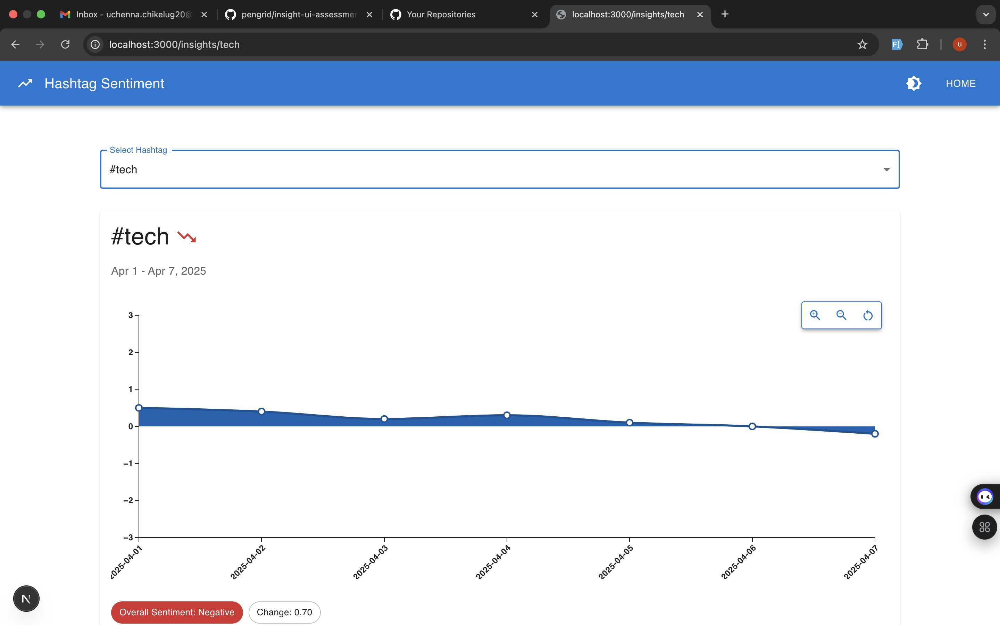

# Hashtag Sentiment App

## Brief Overview
This application analyzes sentiment trends for hashtags over time. It provides an interactive visualization of sentiment data, allowing users to explore how public sentiment around specific hashtags changes. The app features a responsive design with Material UI components and real-time data visualization using MUI X-Charts.

## Screenshots

*Figure 1: The home page showing available hashtags*

*Figure 2: Sentiment analysis for the #uri hashtag*

*Figure 3: Sentiment analysis for the #tech hashtag*

## Time Spent: 4 hours
